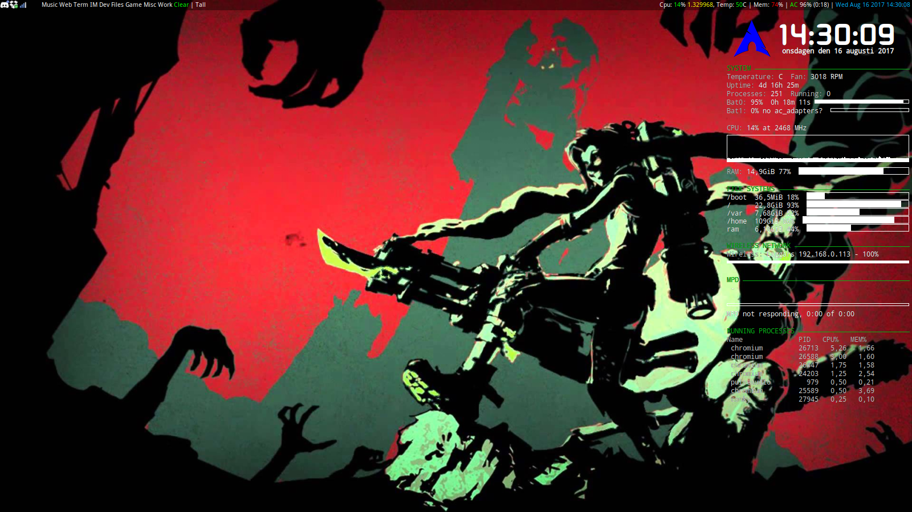

# Xmonad-config

This is my basic Xmonad configuration. It features 11 named workspaces operated by one hand on a normal QWERTY keyboard using Caps lock as a switcher, is lightning-fast, pretty intuitive and quick-starts applications using keyboard commands. I've found it to be quite versatile. 

## Requirements

    xmonad (obviously)
    xmobar
    stalonetray (gives icons)
    conky
    dmenu (for starting applications) (might be optional depending on your definition of 'optional')

### Optional

    Chromium (the web browser)
    Dolphin (my file manager of choice)
    Xterm (terminal)
    Pulseaudio
    scrot (screenshots)
    Kate (text editor for code files and such)
    ttf-openlogos (To get the Arch linux symbol in Conky)

Some other applications have support in my config but are by no means required to run it. Like, for example, League of Legends. 

## What's in here, and how to use it

### .conkyrc

Conky's config file. Simply copy to your home directory and start conky to test it. 

    cp .conkyrc ~/.conkyrc
    conky

### .xinitrc

This file is sourced by the X server when it starts. It might need modifications for your system, or you could just open the file and copy what you like into your existing `~/.xinitrc`. Well-commented, easily understood. 

### .xmobarrc.hs

The configuration of xmobar. Mine is placed in my home directory, but you can place it anywhere and name it whatever you like, as long as you update the location in the xmonad config. 

    cp .xmobarrc.hs ~/.xmobarrc.hs

### .xmodmap

Kustom keyboard shortcuts can be found here. Simply copy to your home. 

    cp .xmodmap ~/.xmodmap

### README.md

This file contains the text you're reading right now. 

### bash.bashrc

This contains my PS1, or what's known as the fancy terminal prompt I have. It's green for users and red for root, displays the current working directory in an intuitive way and the hostname of the machine. REALLY useful if you SSH a lot. It might require some editing to work on your machine. Google "PS1" and it should get you started. 

My file is for system-wide configuration, and can be found in `/etc/bash.bashrc`. 

### xmonad.hs

This is Xmonad's config file. Quite advanced, but it's well-commented to get both me and others to understand it even if we don't know Haskell that well. Mine is located in `~/.xmonad/xmonad.hs`. 
